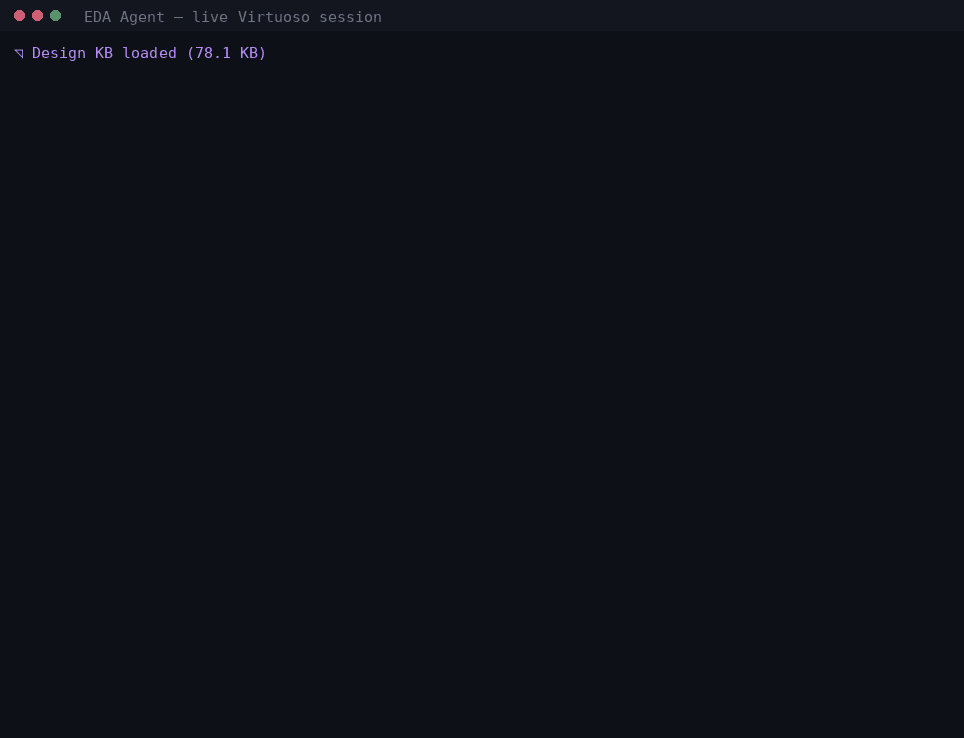
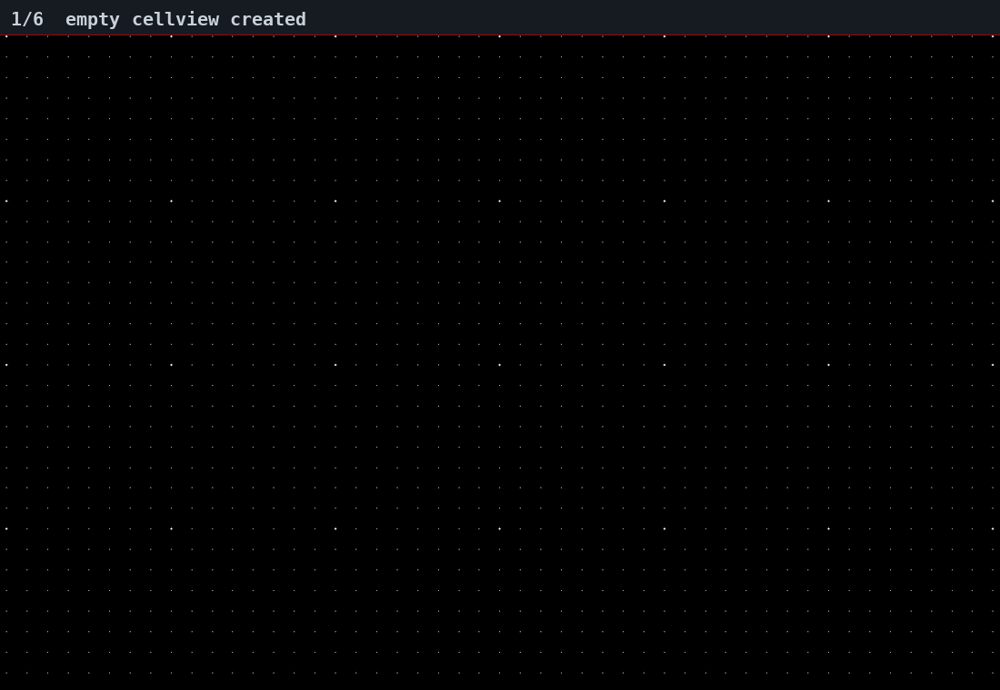
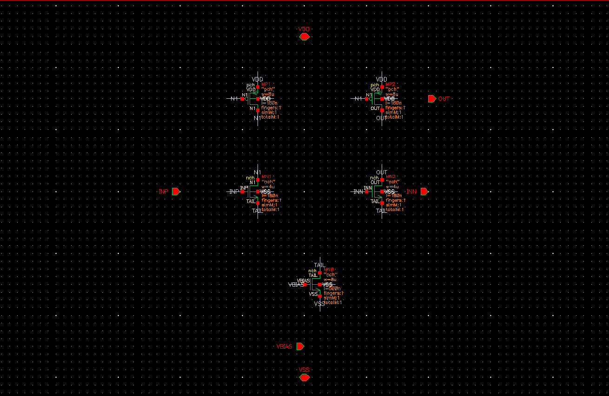
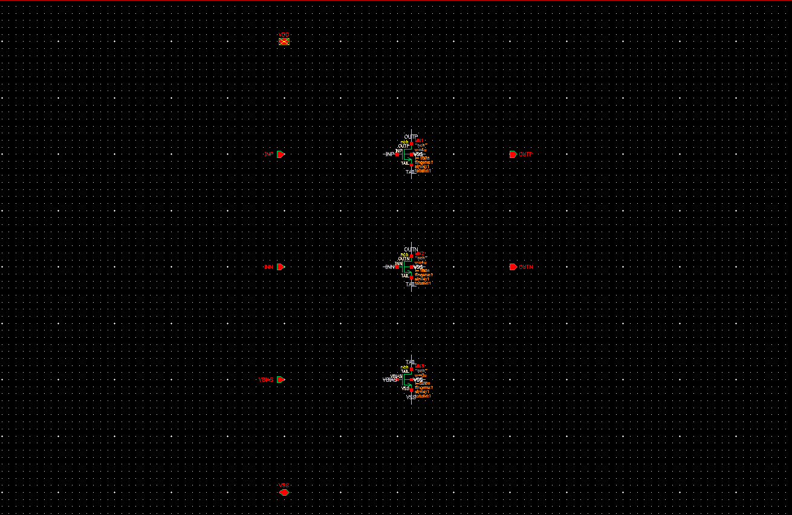
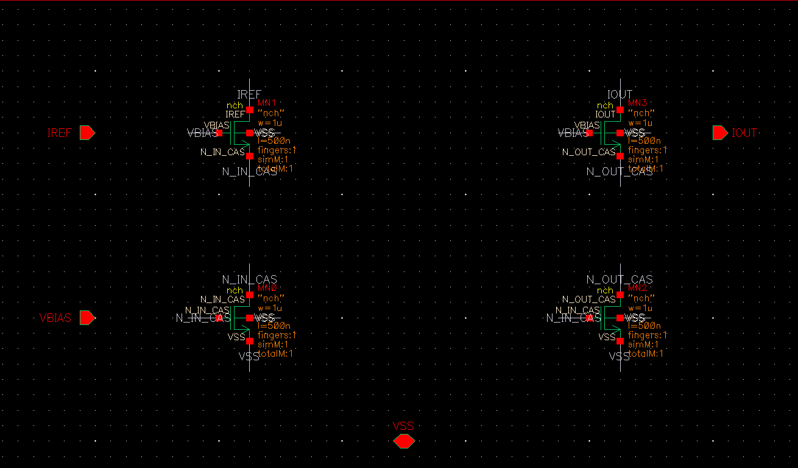
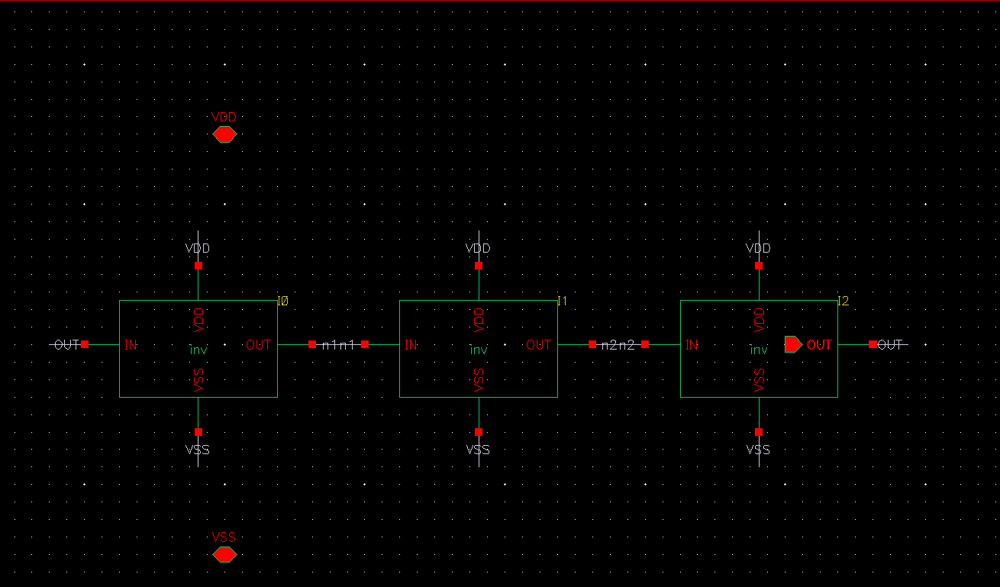
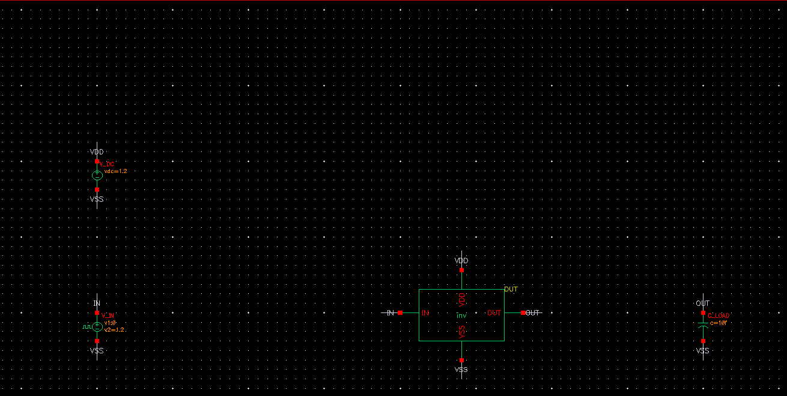
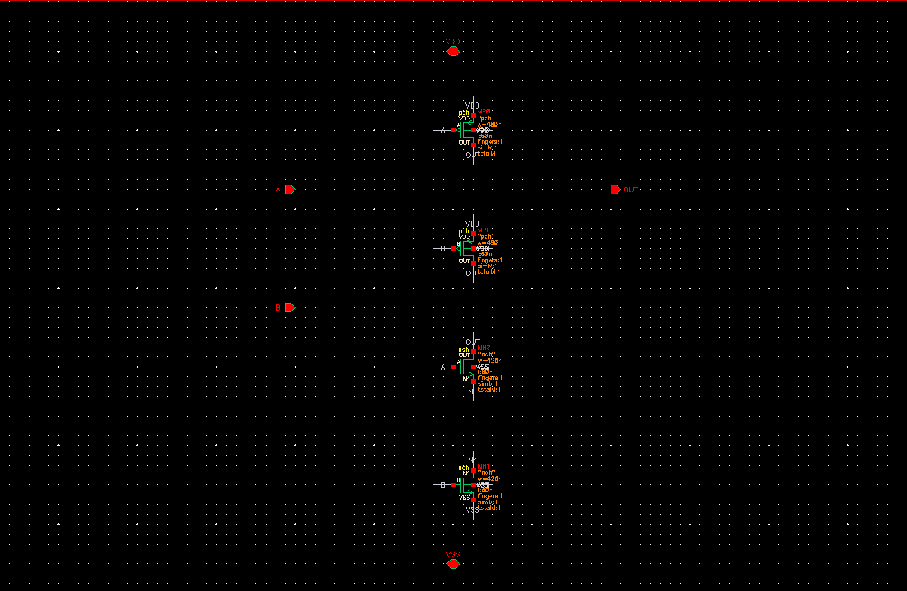

# EDA Agent

An AI-powered assistant for **Cadence Virtuoso** IC design. Describe a circuit in plain English — the agent retrieves the relevant EDA API context, writes Python, executes it against a **live** Virtuoso session over a Python-to-SKILL RPC bridge, reads the result back, and recovers from its own errors.

Built on [virtuoso-bridge-lite](https://github.com/Arcadia-1/virtuoso-bridge-lite) for native connectivity to Cadence Virtuoso.



*A real session: `libs`, a RAG query, then two design tasks — a sized CMOS inverter and a 3-stage ring oscillator built by reusing its symbol. Both completed on the first attempt.*

## Demo

### Watch it build



Every frame is a screenshot of the live Virtuoso session as the schematic was assembled: empty cellview → `nch`/`pch` placed → terminals labelled → pins added → devices sized → symbol generated.

### Circuits built from one-sentence prompts

Each of these is a real `EDA_Agent_Bench` cellview produced by the agent during the benchmark run below — one natural-language prompt each, no hand editing.

| 5-transistor OTA | Differential pair |
|:---:|:---:|
|  |  |
| `nch` pair, `pch` mirror load, tail source | matched inputs + shared tail current source |

| Cascode current mirror | 3-stage ring oscillator |
|:---:|:---:|
|  |  |
| four `nch` devices, W=1u L=500n | hierarchical — instantiates the agent's own `inv` symbol |

| Inverter testbench | 2-input NAND |
|:---:|:---:|
|  |  |
| `vpulse` + `vdc` + load cap, `schCheck`-clean | series NMOS / parallel PMOS |

Also built in the same run: `inv`, `nor2`, `tgate`, `cs_amp`, `cmirror`, `ring_osc_5`.

## How it works

A task passes through four stages before anything touches the design database.

| Stage | What happens |
|-------|--------------|
| **Retrieve** | The task is embedded and matched against two FAISS indexes — the bridge API docs and the scanned design KB — and the top-K sections are prepended to the prompt |
| **Generate** | The LLM returns strict JSON `{plan, code}`; the code is Python against `v` (VirtuosoAPI) and `client` (VirtuosoClient) |
| **Execute** | The code runs in a namespace pre-loaded with `v`, `client`, and the bridge's schematic/layout helpers; `result` carries the outcome |
| **Recover** | On an exception, the traceback, the failed code, matching KB sections, and *semantically similar errors already resolved in past sessions* are fed back for a retry (up to `MAX_RETRIES`) |

### Grounding

The model is never asked to recall the Virtuoso API from memory. Three separate sources are injected:

- **Static API reference** — embedded in every system prompt: the `v`/`client` method surface, the analogLib parameter table, and the gotchas that otherwise fail silently (`vpulse` timing is `per/tr/tf/pw/td`, *not* `period/rise/fall/width/delay`; transistor finger count is `fingers`, not `nf`; minimum `L` is 60n).
- **RAG over the bridge docs** — the knowledge base is split at `##`/`###` headings, embedded with `all-MiniLM-L6-v2` (384-d) and indexed in a FAISS `IndexFlatIP`; vectors are normalised, so inner product *is* cosine similarity. The index is cached to disk keyed by MD5 of the source, so startup after the first run is instant. **136 sections** indexed.
- **Design KB scanned from real libraries** — `tools/scan_libraries.py` walks every custom library in the session and extracts instance usage, transistor sizings, Wp/Wn ratios, testbench topologies and the full CDF parameter catalog. `tools/build_design_kb.py` distils that into a KB the agent both retrieves from and reads as system context. Current scan: **30 libraries, 2850 cells, 101 testbenches, 1004 catalogued components** → **66 indexed sections**.

### Error memory

Every failure is appended to a JSONL log with its task, traceback and the code that failed. A new error is embedded and compared against the log — at cosine ≥ 0.85 it increments an existing entry's frequency counter instead of duplicating it. When a retry succeeds, the entry is marked resolved and the working code is stored as `fix_code`.

The payoff lands on the *next* failure: `retrieve_similar_errors()` pulls the closest resolved entries and injects the fix that worked before into the retry prompt, so a given gotcha is paid for once rather than every session.

## Round-trips, measured

Grounding is the whole point of the pipeline, so it is measured rather than asserted. `tools/benchmark_roundtrips.py` runs the same 12 schematic tasks against a live Virtuoso session under three levels of grounding and counts **round-trips** — one `chat_session.send_message()` call, the unit that costs latency and tokens. A task that lands first try costs 2 (generate, then confirm); every failed attempt adds one. Success is **verified against Virtuoso** — the cell and its views must actually exist — not inferred from the absence of an exception.

| Condition | Static API reference | RAG | Design KB | Error memory |
|-----------|:---:|:---:|:---:|:---:|
| `bare` | ✗ | ✗ | ✗ | ✗ |
| `cold` | ✓ | ✗ | ✗ | ✗ |
| `grounded` | ✓ | ✓ | ✓ | ✓ |

| | `bare` | `cold` | `grounded` |
|---|---:|---:|---:|
| tasks completed | 0/12 | 11/12 | **12/12** |
| mean round-trips | 4.75 | 2.33 | **2.00** |

**Grounding cuts round-trips by 58%** (4.75 → 2.00 per task) and takes completion from 0/12 to 12/12, across 12 schematics on `deepseek-v4-pro`.

Two details worth reading before quoting that number:

- `bare` never succeeds — it builds a correct schematic but never discovers `v.create_symbol()`, which lives in the static API reference, so it burns all four attempts and ends with `views=['schematic']` in 9 of 12 tasks. Its 4.75 mean is a *ceiling* set by `MAX_RETRIES`, so read it alongside the 0/12, not instead of it.
- `cold` already sits at the 2-round-trip floor on the nine simpler cells, which is why retrieval adds only 14% overall. The gain concentrates where tasks get hard — hierarchical reuse and testbench grounding:

| task | `cold` | `grounded` |
|------|-----:|---------:|
| `ring_osc_3` — instantiate the agent's own symbol | 5 | 2 |
| `ring_osc_5` — same, 5 stages | failed | 2 |
| `inv_tb` — testbench that must pass `schCheck` | 4 | 2 |

Full table, methodology and caveats: **[docs/benchmark.md](docs/benchmark.md)**.

## Architecture

```
┌──────────────────────────────────────────────────────────┐
│                      User (CLI REPL)                     │
├──────────────────────────────────────────────────────────┤
│                                                          │
│  ┌──────────────┐   ┌──────────────┐   ┌──────────────┐  │
│  │  RAG Engine  │   │  LLM Session │   │  Error KB    │  │
│  │ (FAISS +     │   │ (Gemini /    │   │ (semantic    │  │
│  │  sentence-   │   │  DeepSeek /  │   │  dedup +     │  │
│  │  transformers│   │  Claude)     │   │  resolution) │  │
│  └──────┬───────┘   └──────┬───────┘   └──────┬───────┘  │
│         │                  │                  │          │
│         └──────────┬───────┘──────────────────┘          │
│                    │                                     │
│              ┌─────▼──────┐                              │
│              │ Agent Loop │ ◄── generate → execute →     │
│              │            │     retry with context       │
│              └─────┬──────┘                              │
│                    │                                     │
│              ┌─────▼──────┐                              │
│              │VirtuosoAPI │ ◄── Python methods wrapping  │
│              │            │     SKILL commands           │
│              └─────┬──────┘                              │
│                    │                                     │
├────────────────────┼─────────────────────────────────────┤
│              ┌─────▼──────┐                              │
│              │ virtuoso-  │ ◄── SSH tunnel + SKILL IPC   │
│              │ bridge-lite│                              │
│              └─────┬──────┘                              │
│                    │                                     │
│              ┌─────▼──────┐                              │
│              │  Cadence   │                              │
│              │  Virtuoso  │                              │
│              └────────────┘                              │
└──────────────────────────────────────────────────────────┘
```

## Features

- **Natural language → circuit design** — describe what you want; the agent generates and executes the Python
- **Multi-provider LLM support** — Google Gemini (API key or Vertex AI), NVIDIA NIM (DeepSeek, Nemotron), and any Anthropic-compatible endpoint
- **RAG knowledge retrieval** — semantic search over the virtuoso-bridge-lite documentation using sentence-transformers + FAISS
- **Design knowledge base** — scanned library data (transistor sizings, testbench patterns, CDF parameters) injected as context
- **Self-improving error handling** — errors logged with semantic dedup; resolved errors and their fixes surface on future similar failures
- **Cost tracking** — per-call token usage and cost estimation across all supported models
- **Library scanner** — automated extraction of instance usage, transistor sizing, and Wp/Wn ratios from all custom Virtuoso libraries

## Prerequisites

- **Python 3.10+**
- **Cadence Virtuoso** with a running SKILL bridge daemon
- **virtuoso-bridge-lite** installed and configured (`virtuoso-bridge start`)
- An LLM API key (Google Gemini, NVIDIA NIM, or an Anthropic-compatible endpoint)

## Setup

```bash
# 1. Clone and enter the project
git clone <your-repo-url>
cd EDA_Agent

# 2. Create a virtual environment
python -m venv .venv
source .venv/bin/activate

# 3. Install dependencies
pip install -r requirements.txt

# 4. Configure environment
cp .env.example .env
# Edit .env with your API keys and provider choice

# 5. Start the Virtuoso bridge (separate terminal), then load the
#    printed SKILL file in the Virtuoso CIW
virtuoso-bridge start
virtuoso-bridge status        # expect: tunnel running + daemon connected

# 6. Run the agent
python -m eda_agent.cli
```

## Usage

### Interactive session

```
$ python -m eda_agent.cli
📐 Design KB loaded (78.1 KB)
Connecting to Virtuoso...
✅ Connected  |  Server time: Sep 25 01:31:29 2026
  📚 Main KB: 136 sections indexed
  📐 Design KB: 66 sections indexed
============================================================
🤖 EDA Agent  (anthropic/deepseek-v4-pro | RAG + Design KB)
Commands: 'status', 'libs', 'cells <lib>', '/rag <query>', '/scan', 'exit'
============================================================

> Create a CMOS inverter named inv_demo in library EDA_Agent_Demo with Wp=480n Wn=210n L=60n, and generate its symbol view.

  📋 Plan: Create library EDA_Agent_Demo (if needed), build inv_demo schematic
     with PMOS (W=480n) and NMOS (W=210n), both L=60n, add IN/OUT/VDD/VSS pins,
     save, then generate symbol view.

  ⚙️  Executing (attempt 1)...
  ✅ Result: Created EDA_Agent_Demo/inv_demo schematic and symbol. Views: ['symbol', 'schematic']

  📊 Tokens — in: 4,243  out: 864  |  ~$0.0000
```

### Built-in commands

| Command | Description |
|---------|-------------|
| `status` | Show current cellview (lib/cell/view) |
| `libs` | List all open Virtuoso libraries |
| `cells <lib>` | List cells in a library |
| `/rag <query>` | Semantic search on the knowledge base |
| `/scan` | Show library scan summary |
| `exit` | Exit the agent |

### Library scanner

```bash
# Scan all custom libraries into data/library_scan_dataset.json
python tools/scan_libraries.py

# Distil the scan into the design KB the agent reads
python tools/build_design_kb.py
```

### Docs and benchmark tooling

```bash
# Re-run the grounding benchmark (needs a live Virtuoso session)
python tools/benchmark_roundtrips.py
python tools/benchmark_roundtrips.py --tasks 4 --conditions bare grounded

# Re-capture the screenshots and animations in docs/media/
python tools/capture_screenshots.py --lib EDA_Agent_Bench --all
python tools/capture_screenshots.py --steps
python tools/make_demo_gifs.py --frames "docs/media/step_*.png" --out docs/media/inv_build.gif
```

## Project structure

```
EDA_Agent/
├── README.md                         # This file
├── .gitignore                        # Python + project-specific ignores
├── .env.example                      # Template env file (no secrets)
├── requirements.txt                  # Dependencies
├── eda_agent/                        # Main Python package
│   ├── __init__.py                   # Package metadata
│   ├── config.py                     # Environment, paths, constants
│   ├── virtuoso_api.py               # Python → SKILL bridge wrapper
│   ├── agent.py                      # Core loop: RAG → LLM → execute → retry
│   ├── cli.py                        # Interactive REPL entry point
│   ├── llm/                          # LLM provider abstraction
│   │   ├── base.py                   # Shared LLMResponse type
│   │   ├── gemini.py                 # Google Gemini session
│   │   ├── openai_compat.py          # OpenAI-compatible (NVIDIA NIM / DeepSeek)
│   │   ├── anthropic_compat.py       # Anthropic-compatible (Claude / DeepSeek)
│   │   └── cost.py                   # Token usage + cost tracking
│   ├── rag/                          # Retrieval-Augmented Generation
│   │   └── knowledge_base.py         # FAISS semantic search over markdown
│   ├── errors/                       # Error logging & learning
│   │   └── error_log.py              # Persistent error KB with dedup
│   └── prompts/                      # System prompts
│       ├── api_reference.py          # Full API reference for the LLM
│       └── system_prompt.py          # System prompt builder
├── tools/                            # Standalone scripts
│   ├── scan_libraries.py             # Virtuoso library scanner
│   ├── build_design_kb.py            # Design KB generator
│   ├── benchmark_roundtrips.py       # Grounding ablation benchmark
│   ├── capture_screenshots.py        # Virtuoso screenshot capture for docs
│   └── make_demo_gifs.py             # README animations
├── docs/
│   ├── benchmark.md                  # Full benchmark results
│   └── media/                        # Screenshots + GIFs
└── data/                             # Runtime data (gitignored)
    ├── virtuoso_bridge_knowledge_base.md
    ├── design_knowledge_base.md
    └── library_scan_dataset.json
```

## Configuration

All configuration is via environment variables (loaded from `.env`):

| Variable | Description | Default |
|----------|-------------|---------|
| `LLM_PROVIDER` | LLM backend to use | `gemini_adc` |
| `GOOGLE_API_KEY` | Gemini API key | — |
| `GOOGLE_CLOUD_PROJECT` | Vertex AI project ID | — |
| `GEMINI_MODEL` | Gemini model name | `gemini-2.5-pro` |
| `NVIDIA_API_KEY` | NVIDIA NIM API key | — |
| `NVIDIA_MODEL` | NIM model name | `deepseek-ai/deepseek-v4-pro` |
| `ANTHROPIC_AUTH_TOKEN` | Token for an Anthropic-compatible endpoint | — |
| `ANTHROPIC_BASE_URL` | Endpoint URL (omit to use Anthropic directly) | — |
| `ANTHROPIC_MODEL` | Model name for that endpoint | `claude-sonnet-5` |

**Supported `LLM_PROVIDER` values:**
- `gemini_adc` / `gemini` — Google Gemini via API key or Vertex AI
- `nvidia_nim` / `nim` — NVIDIA NIM endpoint
- `deepseek_nim` / `deepseek` — DeepSeek via NVIDIA NIM
- `anthropic` / `deepseek_anthropic` — any Anthropic-compatible endpoint, including DeepSeek's (`https://api.deepseek.com/anthropic`)

> Reasoning models are served their whole token budget as `thinking` blocks and can hit `max_tokens` before emitting any answer. The Anthropic-compatible session disables thinking for `deepseek`/`nemotron`/`qwen3` models automatically.

## Tech stack

- **LLM providers**: Google Gemini, DeepSeek V4 Pro (NVIDIA NIM or Anthropic-compatible), Claude
- **RAG**: sentence-transformers (`all-MiniLM-L6-v2`) + FAISS `IndexFlatIP`
- **EDA bridge**: virtuoso-bridge-lite (SKILL IPC over SSH tunnel)

## License

This project is for academic and research purposes.
