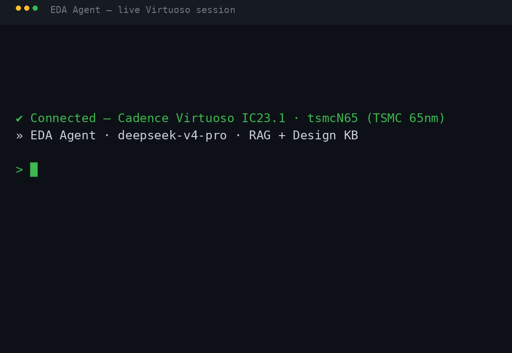
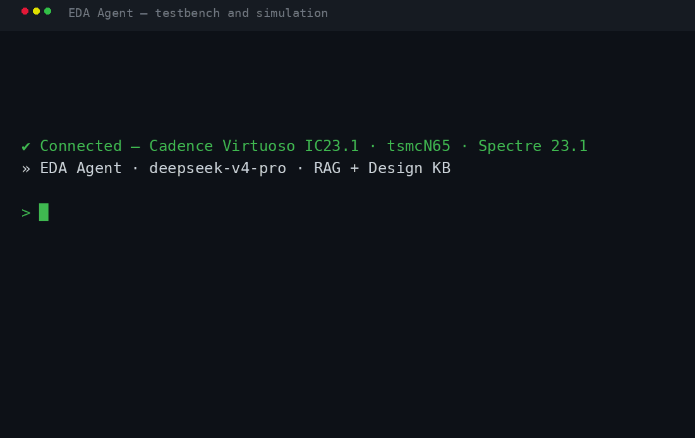
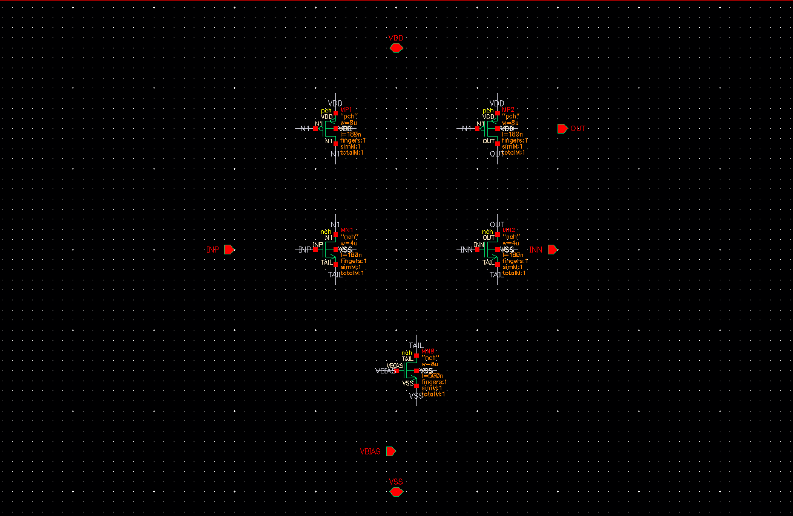
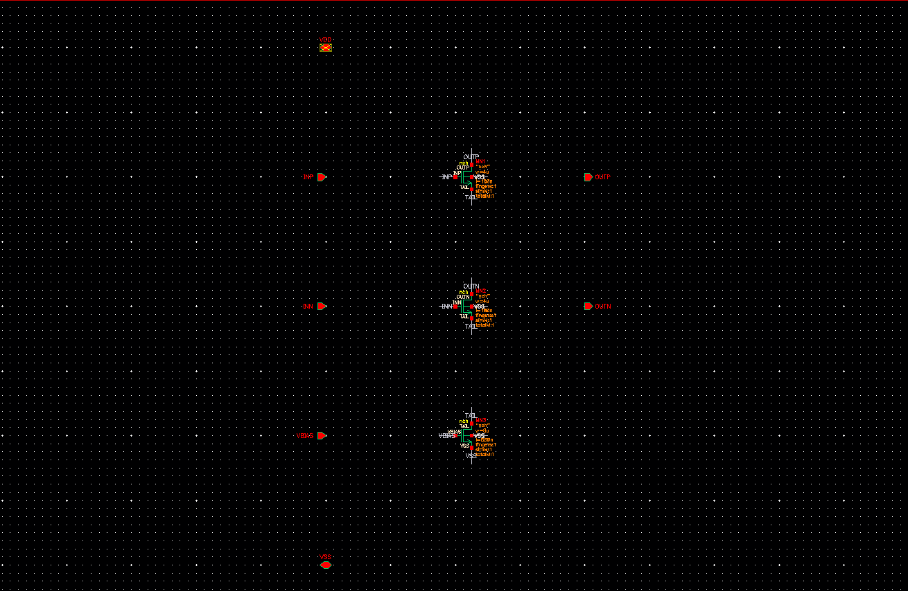
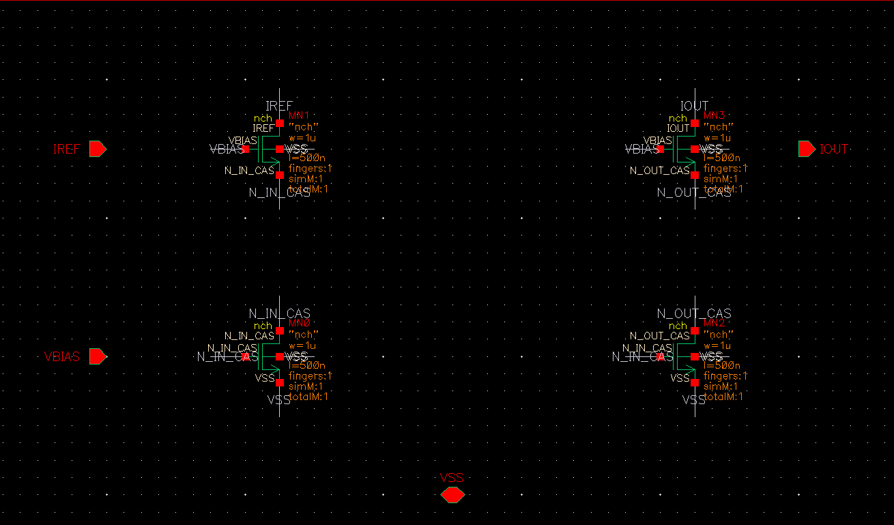
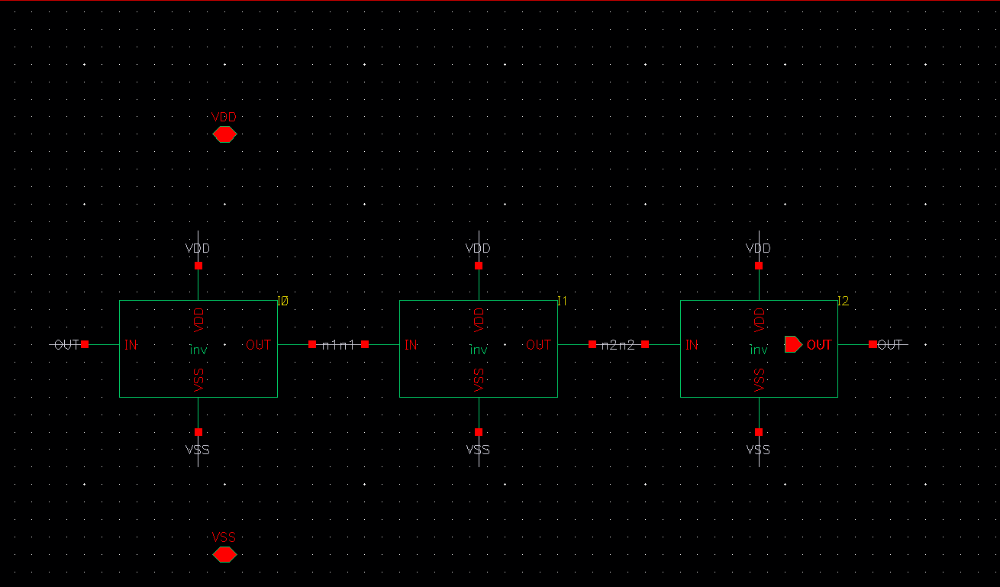
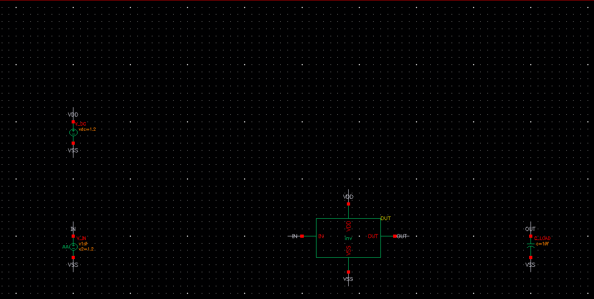
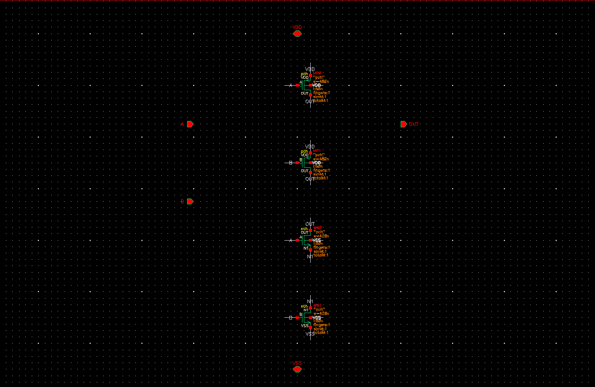

# EDA Agent

An AI-powered assistant for **Cadence Virtuoso** IC design. Describe a circuit in plain English — the agent retrieves the relevant EDA API context, writes Python, executes it against a **live** Virtuoso session over a Python-to-SKILL RPC bridge, reads the result back, and recovers from its own errors.

Built on [virtuoso-bridge-lite](https://github.com/Arcadia-1/virtuoso-bridge-lite) for native connectivity to Cadence Virtuoso.



*One sentence in, a sized CMOS inverter out. The schematic frames are real screenshots of the live Virtuoso session captured at each construction step — empty cellview → `nch`/`pch` placed → terminals labelled → pins added → devices sized → symbol generated.*

## Demo

### Testbench and simulation



The agent builds the testbench, Maestro runs a 20 ns transient through Spectre,
and the waveform comes back out of Virtuoso: OUT (yellow) is the exact
complement of IN (red), rail-to-rail — 7 µV low, 1.199987 V high against a 1.2 V
supply. Every benchmark task below is scored on measurements like these.

### Circuits built from one-sentence prompts

Each of these is a real `EDA_Agent_Bench` cellview produced by the agent during the benchmark run below — one natural-language prompt each, no hand editing.

| 5-transistor OTA | Differential pair |
|:---:|:---:|
|  |  |
| `nch` pair, `pch` mirror load, tail source | matched inputs + shared tail current source |

| Cascode current mirror | 3-stage ring oscillator |
|:---:|:---:|
|  |  |
| four `nch` devices, W=1u L=500n | hierarchical — instantiates the agent's own `inv` symbol |

| Inverter testbench | 2-input NAND |
|:---:|:---:|
|  |  |
| `vpulse` + `vdc` + load cap, `schCheck`-clean | series NMOS / parallel PMOS |

Also built in the same run: `inv`, `nor2`, `tgate`, `cs_amp`, `cmirror`, `ring_osc_5`.

## How it works

A task passes through four stages before anything touches the design database.

| Stage | What happens |
|-------|--------------|
| **Retrieve** | The task is embedded and matched against two FAISS indexes — the bridge API docs and the scanned design KB — and the top-K sections are prepended to the prompt |
| **Generate** | The LLM returns strict JSON `{plan, code}`; the code is Python against `v` (VirtuosoAPI) and `client` (VirtuosoClient) |
| **Execute** | The code runs in a namespace pre-loaded with `v`, `client`, and the bridge's schematic/layout helpers; `result` carries the outcome |
| **Recover** | On an exception, the traceback, the failed code, matching KB sections, and *semantically similar errors already resolved in past sessions* are fed back for a retry (up to `MAX_RETRIES`) |

### Grounding

The model is never asked to recall the Virtuoso API from memory. Three separate sources are injected:

- **Static API reference** — embedded in every system prompt: the `v`/`client` method surface, the analogLib parameter table, and the gotchas that otherwise fail silently (`vpulse` timing is `per/tr/tf/pw/td`, *not* `period/rise/fall/width/delay`; transistor finger count is `fingers`, not `nf`; minimum `L` is 60n).
- **RAG over the bridge docs** — the knowledge base is split at `##`/`###` headings, embedded with `all-MiniLM-L6-v2` (384-d) and indexed in a FAISS `IndexFlatIP`; vectors are normalised, so inner product *is* cosine similarity. The index is cached to disk keyed by MD5 of the source, so startup after the first run is instant. **136 sections** indexed.
- **Design KB scanned from real libraries** — `tools/scan_libraries.py` walks every custom library in the session and extracts instance usage, transistor sizings, Wp/Wn ratios, testbench topologies and the full CDF parameter catalog. `tools/build_design_kb.py` distils that into a KB the agent both retrieves from and reads as system context. Current scan: **30 libraries, 2850 cells, 101 testbenches, 1004 catalogued components** → **66 indexed sections**.

### Where the retrieval corpora come from

Neither knowledge base is hand-written prose — one is vendor documentation, the
other is extracted from the user's own silicon.

**1. Bridge API KB — `data/virtuoso_bridge_knowledge_base.md`** (13 MB, **136
indexed sections**). The complete
[virtuoso-bridge-lite](https://github.com/Arcadia-1/virtuoso-bridge-lite)
reference: the `VirtuosoClient` surface, schematic and layout editing, Maestro /
ADE Assembler, the Spectre simulator, netlist syntax, and a troubleshooting
chapter. It is split at `##`/`###` headings, so a retrieved chunk is a whole
coherent topic (e.g. *9.3 Running Simulations*) rather than an arbitrary window.
Sections under 50 characters are dropped, which is why 1300+ headings reduce to
136 substantive sections.

**2. Design KB — `data/design_knowledge_base.md`** (102 KB, **66 indexed
sections**), generated in two steps from the live session:

```bash
python tools/scan_libraries.py    # walks every custom library -> library_scan_dataset.json
python tools/build_design_kb.py   # distils that scan -> design_knowledge_base.md
```

`scan_libraries.py` walks all non-system libraries and records, per cell,
`is_testbench`, `pins`, `nets`, `instances`, `transistors`, `sources`,
`dut_instances` and `wp_wn_ratio`. The current scan covers **30 libraries, 2850
cells, 101 testbenches and 1004 catalogued components** (193 MB of raw JSON).
`build_design_kb.py` compresses that into six retrievable sections: a testbench
recipe, real testbench examples lifted from the scanned libraries, a MOSFET
sizing reference (the observed Wp/Wn ≈ 2.27), the master CDF parameter catalog,
a tsmcN65 component quick reference, and a per-library summary.

This second corpus is what makes the agent match *house* conventions — real
sizings and testbench topologies from tapeout-proven cells — rather than
plausible-looking generic values. It is regenerated by re-running the two
scripts, so it tracks the libraries as they change.

**Indexing.** Both are embedded with `all-MiniLM-L6-v2` (384-d) into a FAISS
`IndexFlatIP`; vectors are normalised so inner product equals cosine similarity.
Each index is cached to disk keyed by the MD5 of its source file, so only the
first load pays the embedding cost. At query time the task text retrieves the
top-K sections from each index and they are prepended to the prompt; on a
*retry*, the error text is used as the query instead, alongside semantically
similar past errors from the error log.

### Error memory

Every failure is appended to a JSONL log with its task, traceback and the code that failed. A new error is embedded and compared against the log — at cosine ≥ 0.85 it increments an existing entry's frequency counter instead of duplicating it. When a retry succeeds, the entry is marked resolved and the working code is stored as `fix_code`.

The payoff lands on the *next* failure: `retrieve_similar_errors()` pulls the closest resolved entries and injects the fix that worked before into the retry prompt, so a given gotcha is paid for once rather than every session.

## Round-trips, measured

Grounding is the point of the pipeline, so it is measured rather than asserted.
`tools/benchmark_v2.py` runs 18 tasks against a live Virtuoso session and counts
**round-trips** — one `chat_session.send_message()` call, the unit that costs
latency and tokens. A task that lands first try costs 2 (generate, then confirm).

**Success is proven by simulation, not by existence.** The harness builds the
Maestro setup itself, runs a transient, and requires the measured node voltages
to land within 5% of a rail. That matters: an earlier version scored a task
successful when its cellviews existed, which passed a testbench grounded with
plain `VSS` labels — no global ground, no SPICE node 0, impossible to simulate,
yet clean under `schCheck`. The verification simulation is **not** charged to the
agent's round-trip count; it is scoring, not solving.

| | `cold` | `grounded` |
|---|---:|---:|
| static API reference | ✓ | ✓ |
| RAG + design KB + error memory | ✗ | ✓ |
| mean round-trips (18 tasks) | 3.00 | **2.67** |
| tasks verified | 17/18 | 16/18 |
| mean round-trips (6 simulation tasks) | 4.17 | **3.67** |

**Retrieval on top of an already-grounded prompt buys 11% — and on the 15 tasks
both conditions completed, nothing measurable.** Both conditions receive the
shipped ~14 KB static EDA reference, so `cold` is not an ungrounded agent, just
one without retrieval. Nine of the twelve simple cells sit at the 2-round-trip
floor for both. Retrieval only pulls ahead where a task exceeds the static
prompt — `ring_osc_3`: cold 5 round-trips and a failed check, grounded 2.

Ablating grounding **as a whole** is a different question, and there the effect
is large. A `bare` condition with the API reference, rules and retrieval all
stripped — leaving only the JSON output contract:

| | `bare` | `grounded` |
|---|---:|---:|
| mean round-trips | 4.75 | **2.00** |
| tasks completed | 0/12 | **12/12** |

**58% fewer round-trips, 0/12 → 12/12.** `bare` built correct schematics but
never discovered `v.create_symbol()`, burning all four retries in 9 of 12 tasks.

So: **grounding vs none ≈ 58%; retrieval on top of a grounded prompt ≈ 0–11%.**
Full methodology, per-task numbers and caveats — including why `bare`'s mean is a
ceiling set by `MAX_RETRIES` — are in **[docs/benchmark.md](docs/benchmark.md)**.

### Verified independently

Three agent-built modules were re-simulated by hand, at probe points the
benchmark did not score on:

| module | check | measured |
|---|---|---|
| `sbuf` | output must **follow** input | IN 1.2 V → OUT 1.199986 V; IN 0 V → OUT 6.2 µV |
| `snand` | A=B=high → output low | 30.4 µV at 5 ns and 15 ns |
| `snor` | A=B=low → output high | 1.199946 V at 5 ns and 15 ns |

## Architecture

```
┌──────────────────────────────────────────────────────────┐
│                      User (CLI REPL)                     │
├──────────────────────────────────────────────────────────┤
│                                                          │
│  ┌──────────────┐   ┌──────────────┐   ┌──────────────┐  │
│  │  RAG Engine  │   │  LLM Session │   │  Error KB    │  │
│  │ (FAISS +     │   │ (Gemini /    │   │ (semantic    │  │
│  │  sentence-   │   │  DeepSeek /  │   │  dedup +     │  │
│  │  transformers│   │  Claude)     │   │  resolution) │  │
│  └──────┬───────┘   └──────┬───────┘   └──────┬───────┘  │
│         │                  │                  │          │
│         └──────────┬───────┘──────────────────┘          │
│                    │                                     │
│              ┌─────▼──────┐                              │
│              │ Agent Loop │ ◄── generate → execute →     │
│              │            │     retry with context       │
│              └─────┬──────┘                              │
│                    │                                     │
│              ┌─────▼──────┐                              │
│              │VirtuosoAPI │ ◄── Python methods wrapping  │
│              │            │     SKILL commands           │
│              └─────┬──────┘                              │
│                    │                                     │
├────────────────────┼─────────────────────────────────────┤
│              ┌─────▼──────┐                              │
│              │ virtuoso-  │ ◄── SSH tunnel + SKILL IPC   │
│              │ bridge-lite│                              │
│              └─────┬──────┘                              │
│                    │                                     │
│              ┌─────▼──────┐                              │
│              │  Cadence   │                              │
│              │  Virtuoso  │                              │
│              └────────────┘                              │
└──────────────────────────────────────────────────────────┘
```

## Features

- **Natural language → circuit design** — describe what you want; the agent generates and executes the Python
- **Multi-provider LLM support** — Google Gemini (API key or Vertex AI), NVIDIA NIM (DeepSeek, Nemotron), and any Anthropic-compatible endpoint
- **RAG knowledge retrieval** — semantic search over the virtuoso-bridge-lite documentation using sentence-transformers + FAISS
- **Design knowledge base** — scanned library data (transistor sizings, testbench patterns, CDF parameters) injected as context
- **Self-improving error handling** — errors logged with semantic dedup; resolved errors and their fixes surface on future similar failures
- **Cost tracking** — per-call token usage and cost estimation across all supported models
- **Library scanner** — automated extraction of instance usage, transistor sizing, and Wp/Wn ratios from all custom Virtuoso libraries

## Prerequisites

- **Python 3.10+**
- **Cadence Virtuoso** with a running SKILL bridge daemon
- **virtuoso-bridge-lite** installed and configured (`virtuoso-bridge start`)
- An LLM API key (Google Gemini, NVIDIA NIM, or an Anthropic-compatible endpoint)

## Setup

```bash
# 1. Clone and enter the project
git clone <your-repo-url>
cd EDA_Agent

# 2. Create a virtual environment
python -m venv .venv
source .venv/bin/activate

# 3. Install dependencies
pip install -r requirements.txt

# 4. Configure environment
cp .env.example .env
# Edit .env with your API keys and provider choice

# 5. Start the Virtuoso bridge (separate terminal), then load the
#    printed SKILL file in the Virtuoso CIW
virtuoso-bridge start
virtuoso-bridge status        # expect: tunnel running + daemon connected

# 6. Run the agent
python -m eda_agent.cli
```

## Usage

### Interactive session

```
$ python -m eda_agent.cli
📐 Design KB loaded (78.1 KB)
Connecting to Virtuoso...
✅ Connected  |  Server time: Sep 25 01:31:29 2026
  📚 Main KB: 136 sections indexed
  📐 Design KB: 66 sections indexed
============================================================
🤖 EDA Agent  (anthropic/deepseek-v4-pro | RAG + Design KB)
Commands: 'status', 'libs', 'cells <lib>', '/rag <query>', '/scan', 'exit'
============================================================

> Create a CMOS inverter named inv_demo in library EDA_Agent_Demo with Wp=480n Wn=210n L=60n, and generate its symbol view.

  📋 Plan: Create library EDA_Agent_Demo (if needed), build inv_demo schematic
     with PMOS (W=480n) and NMOS (W=210n), both L=60n, add IN/OUT/VDD/VSS pins,
     save, then generate symbol view.

  ⚙️  Executing (attempt 1)...
  ✅ Result: Created EDA_Agent_Demo/inv_demo schematic and symbol. Views: ['symbol', 'schematic']

  📊 Tokens — in: 4,243  out: 864  |  ~$0.0000
```

### Built-in commands

| Command | Description |
|---------|-------------|
| `status` | Show current cellview (lib/cell/view) |
| `libs` | List all open Virtuoso libraries |
| `cells <lib>` | List cells in a library |
| `/rag <query>` | Semantic search on the knowledge base |
| `/scan` | Show library scan summary |
| `exit` | Exit the agent |

### Library scanner

```bash
# Scan all custom libraries into data/library_scan_dataset.json
python tools/scan_libraries.py

# Distil the scan into the design KB the agent reads
python tools/build_design_kb.py
```

### Docs and benchmark tooling

```bash
# Re-run the grounding benchmark (needs a live Virtuoso session)
python tools/benchmark_roundtrips.py
python tools/benchmark_roundtrips.py --tasks 4 --conditions bare grounded

# Re-capture the screenshots and animations in docs/media/
python tools/capture_screenshots.py --lib EDA_Agent_Bench --all
python tools/capture_screenshots.py --steps
python tools/make_demo_gifs.py \
  --prompt "Create a CMOS inverter with Wp=480n, Wn=210n, L=60n and generate its symbol." \
  --header "Connected - Cadence Virtuoso IC23.1 - tsmcN65" \
  --frames "docs/media/step_*.png" --out docs/media/demo.gif
```

## Troubleshooting the bridge

The agent reaches Virtuoso through an SSH tunnel into a SKILL daemon that lives
*inside* the Virtuoso process. `/diag` inside the REPL runs these checks for you.

| Symptom | Cause | Fix |
|---|---|---|
| `[tunnel] NOT running` | The local SSH forward died — it does not survive a laptop sleep or a network blip | `virtuoso-bridge start`, or forward the port yourself and leave the remote daemon alone: `ssh -N -o ServerAliveInterval=30 -L 65082:localhost:65081 <user>@<host>` |
| `[daemon] NO RESPONSE` | The daemon dies with Virtuoso | Re-`load()` the printed `virtuoso_setup.il` in the CIW |
| Every call times out, but the tunnel is up | **A modal dialog is blocking SKILL.** Nothing works until it is dismissed in the GUI | Check with `/diag`; dismiss the dialog. Usually an ADE "Not Found" or ASSEMBLER-8127 from a bad Maestro open |
| `[spectre] NOT FOUND` | Usually a **false alarm** — the bridge probes a login shell that never sources the Cadence cshrc | Ignore it if ADE simulates. Virtuoso's own process normally has spectre on PATH; set `VB_CADENCE_CSHRC` only if you need shell-side spectre |
| Maestro session will not close after a run | A run promotes the background session to a UI session (`EXPLORER-8051`), after which `maeCloseSession` always fails — even with `?forceClose` | Close the ADE/Waveform **windows** first, then call plain `maeCloseSession`. `tools/maestro_sim.py --teardown` does this |
| Simulation says `done` but every probe is `nil` | `maeOpenResults` returns `t` while leaving the result context unset, and the history name is not stable (`Interactive.N` vs `ExplorerRun.N`) | Read the PSF directory directly with OCEAN `openResults(<psf dir>)` |

## Project structure

```
EDA_Agent/
├── README.md                         # This file
├── .gitignore                        # Python + project-specific ignores
├── .env.example                      # Template env file (no secrets)
├── requirements.txt                  # Dependencies
├── eda_agent/                        # Main Python package
│   ├── __init__.py                   # Package metadata
│   ├── config.py                     # Environment, paths, constants
│   ├── virtuoso_api.py               # Python → SKILL bridge wrapper
│   ├── agent.py                      # Core loop: RAG → LLM → execute → retry
│   ├── cli.py                        # Interactive REPL entry point
│   ├── llm/                          # LLM provider abstraction
│   │   ├── base.py                   # Shared LLMResponse type
│   │   ├── gemini.py                 # Google Gemini session
│   │   ├── openai_compat.py          # OpenAI-compatible (NVIDIA NIM / DeepSeek)
│   │   ├── anthropic_compat.py       # Anthropic-compatible (Claude / DeepSeek)
│   │   └── cost.py                   # Token usage + cost tracking
│   ├── rag/                          # Retrieval-Augmented Generation
│   │   └── knowledge_base.py         # FAISS semantic search over markdown
│   ├── errors/                       # Error logging & learning
│   │   └── error_log.py              # Persistent error KB with dedup
│   └── prompts/                      # System prompts
│       ├── api_reference.py          # Full API reference for the LLM
│       └── system_prompt.py          # System prompt builder
├── tools/                            # Standalone scripts
│   ├── scan_libraries.py             # Virtuoso library scanner
│   ├── build_design_kb.py            # Design KB generator
│   ├── benchmark_roundtrips.py       # Grounding ablation benchmark
│   ├── capture_screenshots.py        # Virtuoso screenshot capture for docs
│   └── make_demo_gifs.py             # README animations
├── docs/
│   ├── benchmark.md                  # Full benchmark results
│   └── media/                        # Screenshots + GIFs
└── data/                             # Runtime data (gitignored)
    ├── virtuoso_bridge_knowledge_base.md
    ├── design_knowledge_base.md
    └── library_scan_dataset.json
```

## Configuration

All configuration is via environment variables (loaded from `.env`):

| Variable | Description | Default |
|----------|-------------|---------|
| `LLM_PROVIDER` | LLM backend to use | `gemini_adc` |
| `GOOGLE_API_KEY` | Gemini API key | — |
| `GOOGLE_CLOUD_PROJECT` | Vertex AI project ID | — |
| `GEMINI_MODEL` | Gemini model name | `gemini-2.5-pro` |
| `NVIDIA_API_KEY` | NVIDIA NIM API key | — |
| `NVIDIA_MODEL` | NIM model name | `deepseek-ai/deepseek-v4-pro` |
| `ANTHROPIC_AUTH_TOKEN` | Token for an Anthropic-compatible endpoint | — |
| `ANTHROPIC_BASE_URL` | Endpoint URL (omit to use Anthropic directly) | — |
| `ANTHROPIC_MODEL` | Model name for that endpoint | `claude-sonnet-5` |

**Supported `LLM_PROVIDER` values:**
- `gemini_adc` / `gemini` — Google Gemini via API key or Vertex AI
- `nvidia_nim` / `nim` — NVIDIA NIM endpoint
- `deepseek_nim` / `deepseek` — DeepSeek via NVIDIA NIM
- `anthropic` / `deepseek_anthropic` — any Anthropic-compatible endpoint, including DeepSeek's (`https://api.deepseek.com/anthropic`)

> Reasoning models are served their whole token budget as `thinking` blocks and can hit `max_tokens` before emitting any answer. The Anthropic-compatible session disables thinking for `deepseek`/`nemotron`/`qwen3` models automatically.

## Tech stack

- **LLM providers**: Google Gemini, DeepSeek V4 Pro (NVIDIA NIM or Anthropic-compatible), Claude
- **RAG**: sentence-transformers (`all-MiniLM-L6-v2`) + FAISS `IndexFlatIP`
- **EDA bridge**: virtuoso-bridge-lite (SKILL IPC over SSH tunnel)

## License

This project is for academic and research purposes.
